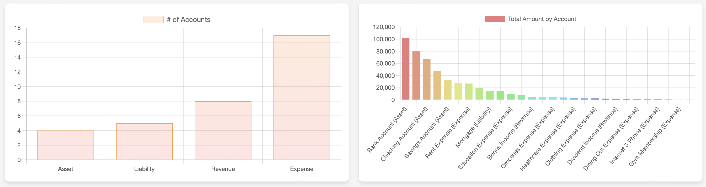
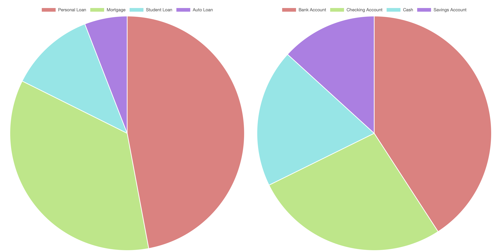
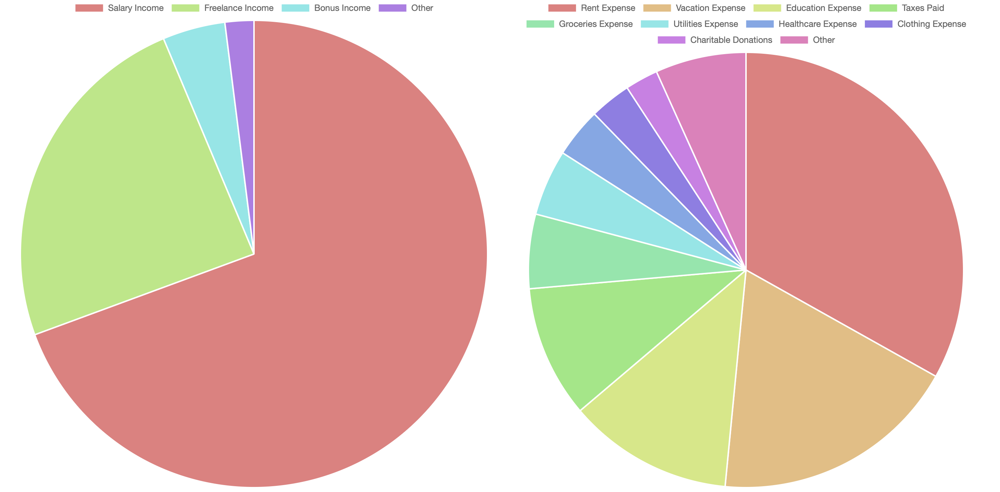

# Accountant API

A Node.js RESTful API for managing accounting data. This application facilitates the management of financial transactions within a double-entry bookkeeping system. It leverages an SQLite database for storing data, ensuring lightweight and straightforward setup suitable for both development environments and small-scale applications.

## Features

- Add accounts and categorize them as assets, liabilities, equity, revenue, or expenses.
- Record financial transactions with detailed information, including date, amount, and descriptions, linking them to specific accounts.
- Retrieve a comprehensive list of transactions, including their associated accounts.
- Update and delete transactions to maintain accurate financial records.
- Simple setup with SQLite database for easy development and testing.

## Getting Started

### Prerequisites

- Node.js installed on your system, available for download at [nodejs.org](https://nodejs.org/).

### Installation

1. Clone the repository:

   ```bash
   git clone git@github.com:yourusername/Accountant.git
   cd Accountant
   ```

2. Install dependencies:

   ```bash
   npm install
   ```

3. Start the server:

   ```bash
   node server.js
   ```

   The server runs on `http://localhost:3000` by default. Interact with the API using a tool like Postman or cURL.

## Samples

To easily test and interact with the API, execute the seeder script to populate your database with sample data:

```bash
node seed.js
```

This script will create a set of predefined accounts, transactions, and possibly sub-accounts, as outlined in the seeder file, enabling you to quickly start testing and developing on a pre-populated database.

## SQLite Database

Open a terminal and navigate to the project directory. To access the SQLite database, run the following command:

```bash
sqlite3 accountant.db
```

This command opens the SQLite shell, allowing you to interact with the database using SQL commands. For example, to view all transactions, execute the following command:

```sql
SELECT * FROM transactions;
```

To exit the SQLite shell, type `.quit` and press Enter.

## Visualizing the Database

### Using `chart.js`

To visualise the database, you can view the `index.html` file in your browser. This file contains a simple web page that uses the `https://cdn.jsdelivr.net/npm/chart.js` library to display the database in a graphical format.

- Counts of accounts are displayed in a bar chart.
  

- The total amount of transactions is displayed in a pie chart.
  
  

## Development Notes

- Enhance the application by adding more sophisticated querying capabilities, such as filtering transactions by date, account, or type.
- Ensure robust input validation for all API endpoints to maintain data integrity and security.
- Utilize environment variables for configuration to facilitate deployment across different environments.
- Consider extending the seeder script for more comprehensive testing and development scenarios.

## Contributing

Contributions are welcome to enhance the application's functionality and usability. Follow the standard GitHub fork-and-pull request workflow for contributions.
